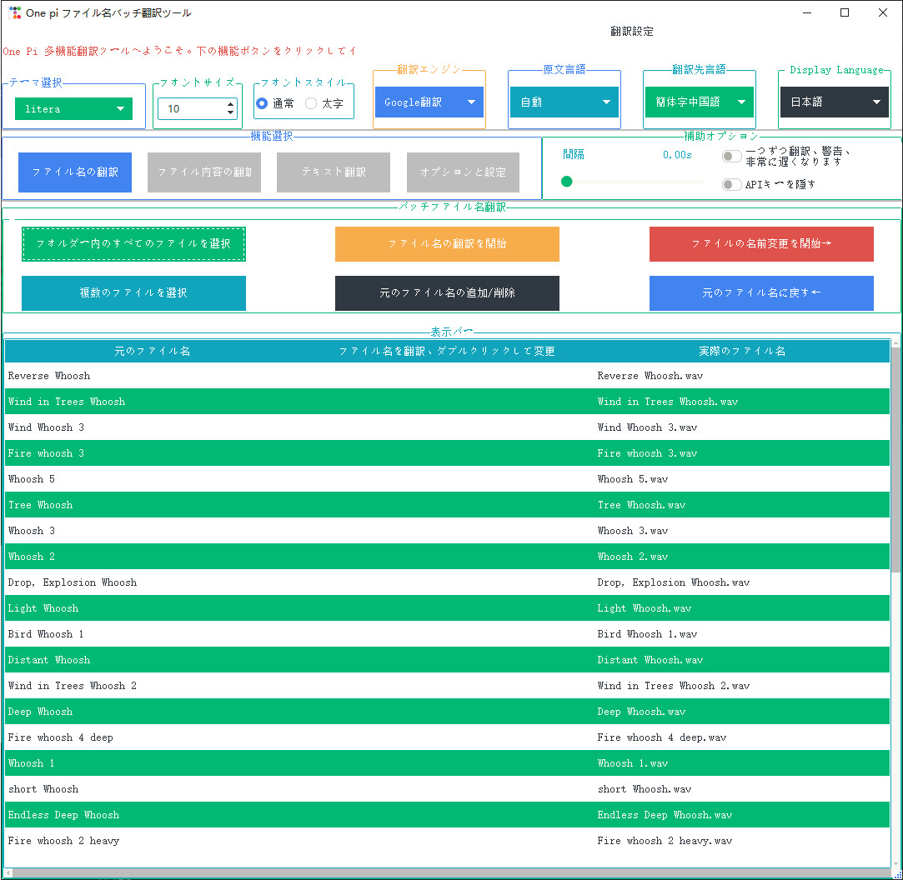
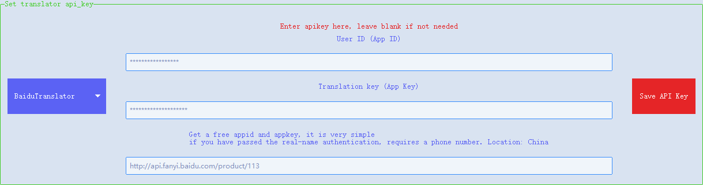
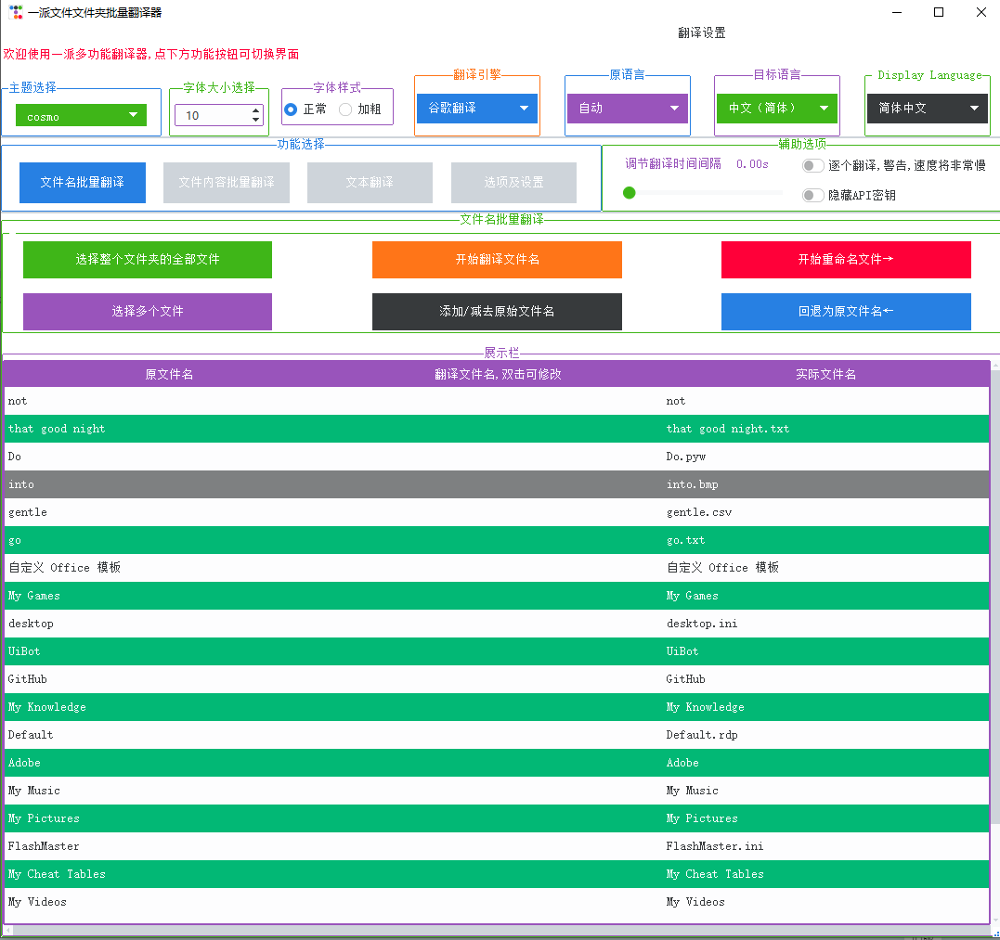
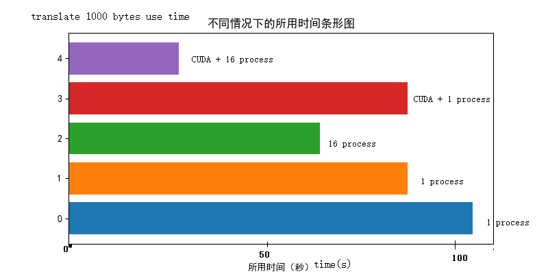
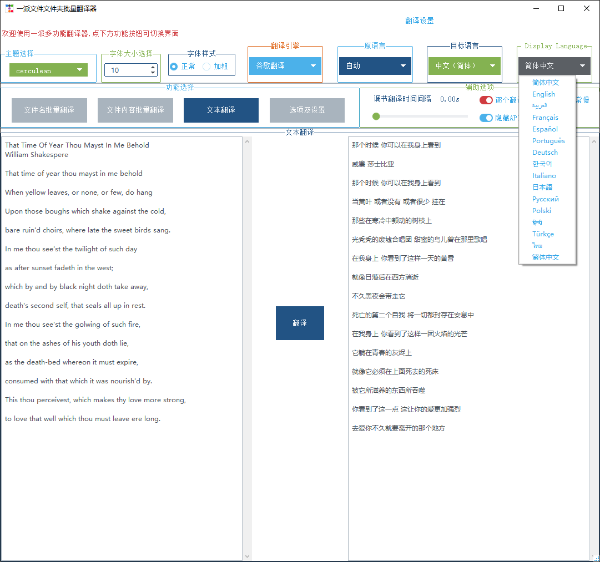
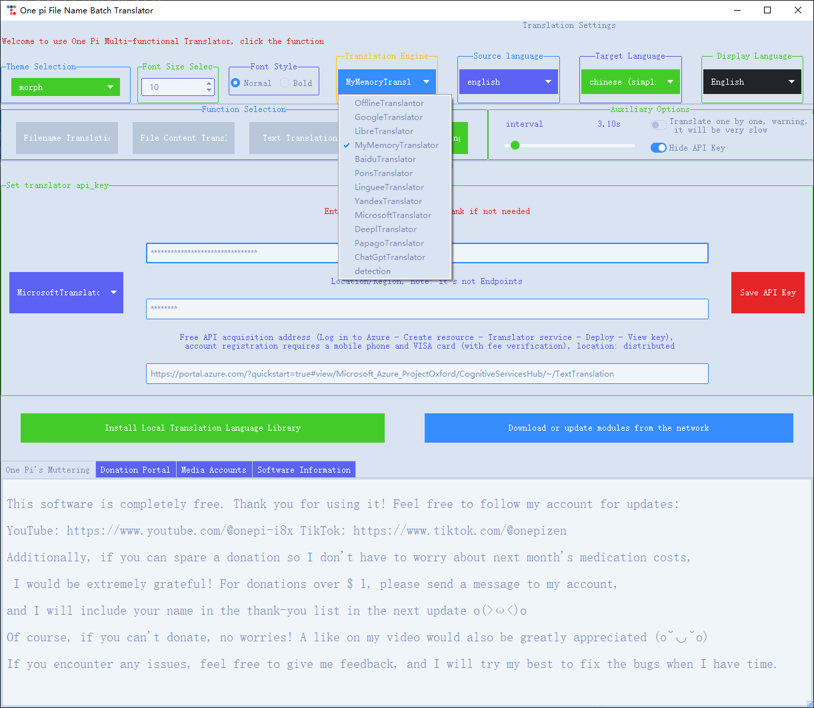
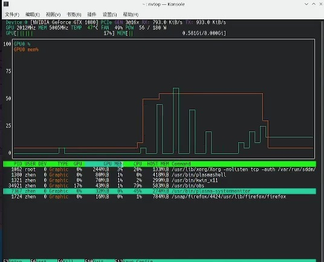

# OnePi Multi-functional Translator
A simple GUI tool for translating text or documents and renaming files or folder names. Uses online (deeptranslator) and offline (Argos Translate) translation.
---

English | [中文](README_zh.md)

An integrated GUI program of offline translation Argos Translate and online translation DeepTranslator, which can be used to translate text, documents or batch translate and rename files or folders. Fixed some minor bugs in DeepTranslator and optimized Argos Translate.

 



# Table of Contents

- [Features](#✨-features)
- [Installation](#🚀-installation)
- [Instructions](#📖-instructions)
- [Video and Documentation Links](#🔗-links)

### The video ⬆️ provides more detailed instructions
## ✨ Features

- 🌐 **Supports Multiple Languages**  
  Supported language options include: Simplified Chinese, English, العربية, Français, Español, Português, Deutsch, 한국어, Italiano, 日本語, Русский, Polski, हिन्दी, Türkçe, ไทย, Traditional Chinese.
  


- ⚙️ **Multiple Translation Engine Integration**  
  Combines online translation (via DeepTranslator) and offline translation (via Argos Translate), and can store API keys, switching between them with one click as needed.


  
  

- 📁 **Batch Translation and Renaming**  
  Supports batch translation of file names or folder names, which can be manually changed after translation, and original file names can be added, then renamed, with undo operation supported after renaming.

  


## 🚀 Installation

### 1️⃣ Installation Package (Recommended for Windows Systems)

- 💻 **Online Installation Package size:19.9M** [china special edition](https://github.com/OnePi-1pi/OnePiTranslator/releases/download/V1.0.0/online_install_windows_cn.exe)

  Download and install to use, no code operation required at all. Suitable for those with good internet connection. After installation, modules still need to be downloaded. 

- 📦 **Package without Argos (Author's Recommendation) size:25.0M** [china special edition](https://github.com/OnePi-1pi/OnePiTranslator/releases/download/V1.0.0/no_argos_install_windows_cn.exe)
  
  Only need to download this package to use online translation. If offline translation is needed later, it can be installed through `install_argos_translate.bat` in the working directory.

- 💽 **Local  Package size:249M** [china special edition](https://github.com/OnePi-1pi/OnePiTranslator/releases/download/V1.0.0/local_install_windows_cn.exe)  
  Contains all necessary components except CUDA acceleration components. Large in size , can use online translation and CPU-driven offline translation after installation. (Will automatically use all CPU processes for large amounts of text, but the speed improvement is still limited, see CUDA installation package description below).

- ~~🖥️ **Installation Package with CUDA** [Link]~~  
  ~~Contains CUDA and matching components like Torch,~~ suitable for users who need GPU acceleration. Large in size (>5G). CUDA can significantly accelerate offline translation time. As the author's graphics card is a modified version of 1080 and the driver cannot be updated under Windows, only CUDA acceleration under Linux has been tested. This is a time statistics chart for different modes.
  
  

### 2️⃣ PyPI Installation (Recommended for Users with Python Already Installed)

```bash
python -m pip install onepitranslator
```
By default, only online translation is installed.

If you need to use offline translation, you can continue to install argostranslate:

```bash
python -m pip install argostranslate
```

In addition, offline translation also requires downloading the `xx_sent_ud_sm` module of spacy:

```bash
python -m spacy download xx_sent_ud_sm
```
Or download manually: ➡️
[Download Link](https://spacy.io/models/xx#xx_sent_ud_sm)

The current version of argostranslate may not be available due to the numpy upgrade, so you can roll back the version:

```bash
python -m pip install "numpy>=1.0.0,<2.0.0"
```

## 📖 Instructions

### 🌍 Language Settings

After downloading, the program should automatically switch to the language of the system's region. If not, you can manually select:




### 📝 Translator Selection

Choose the needed translator, it's recommended to test with text translation first. Most translators require an API Key. You can check in 'Options and Settings' for information about free API Keys and application difficulty. Double-click the URL to jump to it.




### 📂 Batch Translation of File/Folder Names

Supports selecting all files within a single folder (including subfolders), or selecting several files individually (use SHIFT for multiple selection or CTRL for single selection). After translation, you can double-click or right-click to modify, selected items can be deleted by pressing Delete or right-clicking. Supports batch renaming and can undo changes to revert to original file names.

## 🛠️ Example Use Cases

- **Translation Integration**: Integrates multiple translations and has the function of remembering API keys (**Remember to _click the save API key button_!!!**).
- **File Name Translation**: Automatically translates file or folder names into the target language, facilitating cross-language team collaboration.
- **Text Translation**: Supports real-time translation in multiple languages, suitable for scenarios requiring instant text translation.

## 🔗 Links
- **📹 Videos**:
- ***[youtube](https://youtube.com/@onepi-i8x?si=QrX5QF_QR-iaBArL)***
- ***[tiktok](https://www.tiktok.com/@onepizen)***
- ***[Bilibili](https://www.bilibili.com/video/BV1mQe5ePEUp/?share_source=copy_web&vd_source=2479572e87b2a5619bdc6332186b5269)***
- ***[Xigua Video](https://www.ixigua.com/7403916189837853195)***

- **📄 Documentation**: [https://github.com/OnePi-1pi/OnePiTranslator/README_zh.md](https://github.com/OnePi-1pi/OnePiTranslator/README_zh.md)
- **🌐 GitHub**: [https://github.com/OnePi-1pi/OnePiTranslator](https://github.com/OnePi-1pi/OnePiTranslator)
- **deep-translator**: https://github.com/nidhaloff/deep-translator
- **argos-translate**: https://github.com/nidhaloff/deep-translator
- **ttkbootstrap**: https://github.com/israel-dryer/ttkbootstrap

## ❓ Unresolved Issues
When using CUDA to accelerate argostranslate translation, the GPU cannot exert its full capability, seemingly due to an I/O bottleneck. The versions of torch, CUDA, and drivers all match. Attempts to adjust torch parameters, including increasing Batch Size, have not resolved this issue.



---