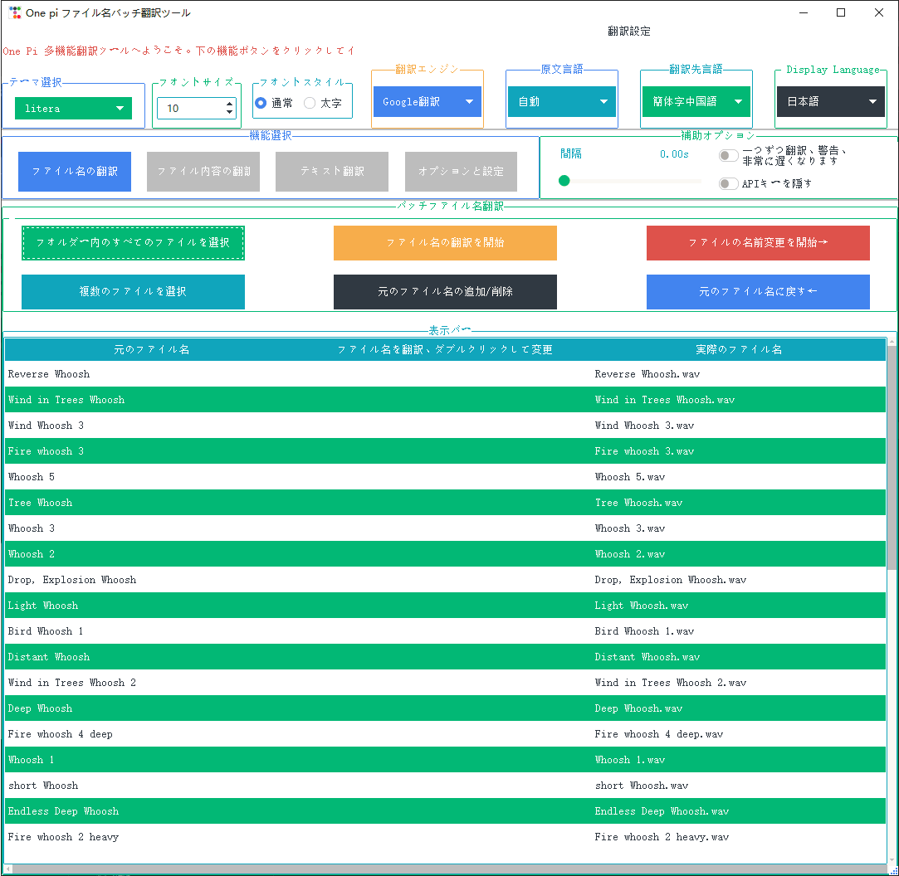
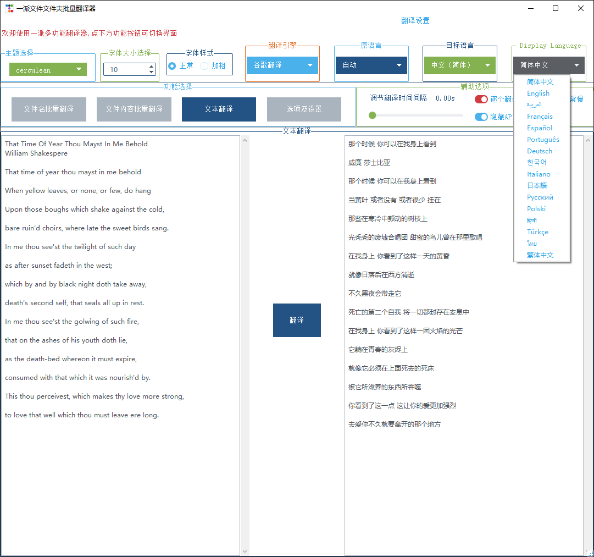
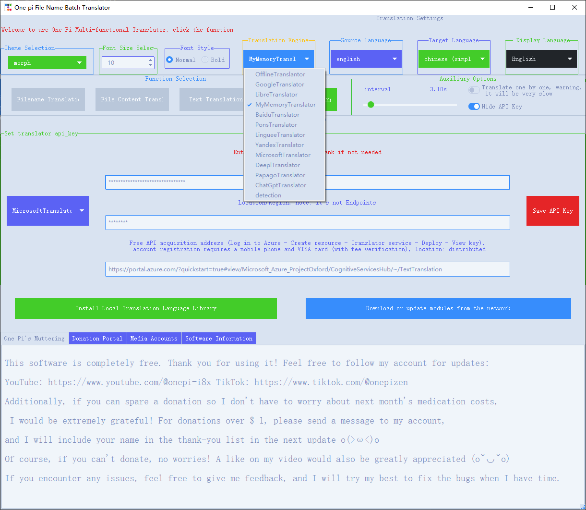
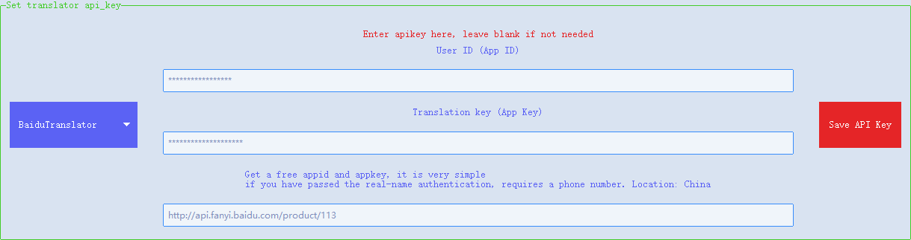
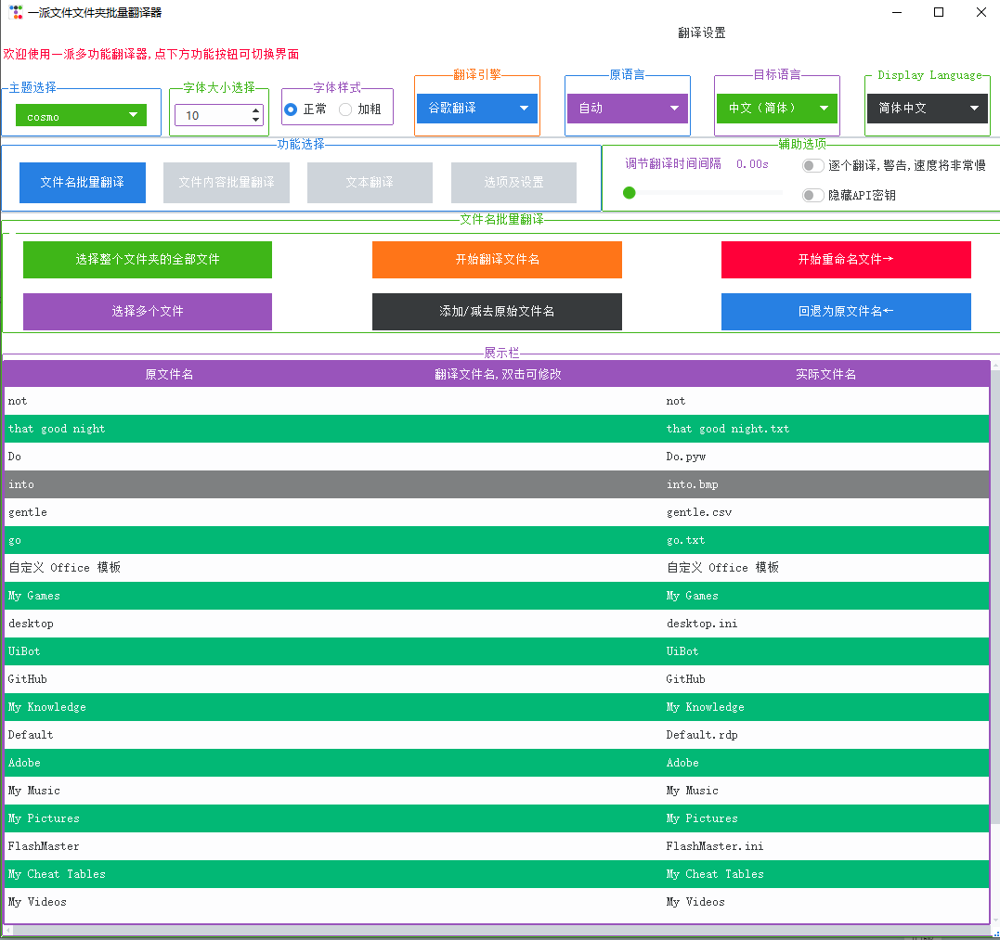

# 一派多功能翻译器
一个简单的GUI工具，用于翻译文本或文档并重命名文件或文件夹名称。使用在线（deeptranslator）和离线（argos翻译）翻译。
---


[English](README.md) | 中文

离线翻译 Argos Translate 与在线翻译 DeepTranslator 的整合版 GUI 程序，可用来翻译文本、文档或批量翻译并重命名文件或文件夹。修复了 DeepTranslator 的一些小 bug，并对 Argos Translate 进行了优化。

 



# 目录

- [功能及特点](#✨-功能及特点)
- [安装](#🚀-安装)
- [使用说明](📖-说明)
- [视频及文档链接](#🔗-链接)

###  视频 ⬆️ 的说明更详细
## ✨ 功能及特点

- 🌐 **支持多种语言**  
  支持的语言选项包括：简体中文、English、العربية、Français、Español、Português、Deutsch、한국어、Italiano、日本語、Русский、Polski、हिन्दी、Türkçe、ไทย、繁体中文。
  
  

- ⚙️ **多翻译引擎整合**  
  结合在线翻译（通过 DeepTranslator）和离线翻译（通过 Argos Translate），且能存储api-key，根据需要一键切换。

  
  
  

- 📁 **批量翻译与重命名**  
  支持批量翻译文件名或文件夹名，翻译后可手动更改，也可添加原文件名，然后重命名，重命名后支持撤销操作。

  

- 🔄 **智能翻译引擎选择**  
  也可支持文本翻译与文档批量翻译，argos在文本量少时仅使用单核，在文本量大时自动使用全部CPU核心。
  - - - - - -

## 🚀 安装

### 1️⃣ 安装包（推荐 Windows 系统）

- 💻 **在线安装包** [链接]  
  下载后安装即用，完全不用任何代码操作。网络好的可以下载。安装后还需要下载模块，针对中国网络优化，自动设置 pypi 源为清华源。

- 📦 **无 Argos 离线安装包（作者推荐）** [链接]
  推荐给不想改变源或不想再下载模块的用户，仅需下载此包即可使用在线翻译。后续如需离线翻译，可通过工作目录下的 `install_argos_translate.bat` 进行安装。

- 💽 **全功能本地安装包** [链接]  
  包含除 CUDA 加速组件外的所有必需组件。体积较大（>2G），安装后可使用在线翻译和 CPU 驱动的离线翻译。（文本量大时会自动启用CPU全进程，但是提升速度依然有限，见下面CUDA安装包描述）。

- 🖥️ **含 CUDA 安装包** [链接]  
  包含 CUDA 及配套的 Torch 等组件，适合需要 GPU 加速的用户。体积较大（>5G）。CUDA可以显著加速离线翻译时间，由于作者显卡是魔改版1080，windows下更不了驱动，因此只测试了linux下的CUDA加速,这是不同模式的时间统计图。
  
  
### 2️⃣ Pypi 安装（推荐已安装 Python 的用户）

```bash
python -m pip install onepitranslator
```
默认只安装在线翻译。

如需使用离线翻译，可继续安装argostranslate：

```bash
python -m pip install argostranslate
```

此外，离线翻译还需下载spacy 的 `xx_sent_ud_sm` 模块：

```bash
python -m spacy download xx_sent_ud_sm
```
或者手动下载：➡️
[下载链接](https://spacy.io/models/xx#xx_sent_ud_sm)

## 📖 说明

### 🌍 语言设置

下载后程序应自动切换到系统所在地区的语言，如果没有，可以手动选择：


### 🔧 功能选择

按需选择功能，选中按钮代表当前所在功能：


### 📝 翻译器选择

选择需要的翻译器，建议先通过文本翻译进行测试。大部分翻译器需要 API Key，有关是否有免费 API Key 以及申请难度，可以在《选项及设置》中查看。双击网址即可跳转。


### 📂 文件/文件夹名批量翻译

支持选择单文件夹内的全部文件（包括子文件夹），或单独选择几个文件（使用 SHIFT 多选或 CTRL 单选）。翻译后可双击或右键修改，选中项可按 Delete 或右键删除。支持批量重命名，并可撤销修改，退回原文件名。

## 🛠️ 示例使用场景

- **翻译整合**: 整合多个翻译并具有记住apikey的功能（**一定要记得 _点保存apikey按钮_！！！**）。
- **文件名翻译**: 自动将文件或文件夹名称翻译为目标语言，方便跨语言团队协作。
- **文本翻译**: 支持多种语言的实时翻译，适合需要即时翻译文本的场景。


## 🔗 链接
- **📹 视频**:
- ***[哔哩哔哩](https://www.bilibili.com/video/BV1mQe5ePEUp/?share_source=copy_web&vd_source=2479572e87b2a5619bdc6332186b5269)***
- ***[西瓜视频](https://www.ixigua.com/7403916189837853195)***
- **📄 文档**: [https://github.com/OnePi-1pi/OnePiTranslator/README_zh.md](https://github.com/OnePi-1pi/OnePiTranslator/README_zh.md)
- **🌐 GitHub**: [https://github.com/OnePi-1pi/OnePiTranslator](https://github.com/OnePi-1pi/OnePiTranslator)
- **deep-translator**:https://github.com/nidhaloff/deep-translator
- **argos-translate**:https://github.com/nidhaloff/deep-translator
- **ttkbootstrap**:https://github.com/israel-dryer/ttkbootstrap

## ❓ 未解决问题
在使用CUDA加速argostranslate翻译时，GPU不能发挥全部能力，貌似有io瓶颈。torch与CUDA与驱动版本均吻合。尝试调高torch参数，包括增大Batch Size等，均未解决此问题。


---
